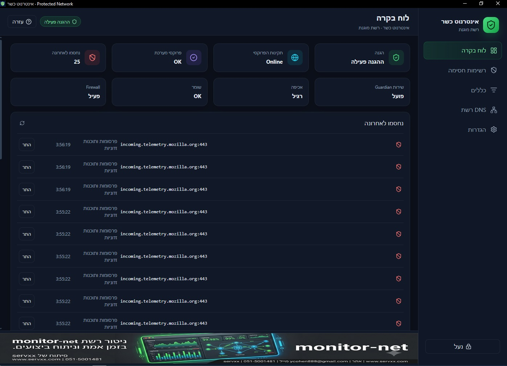
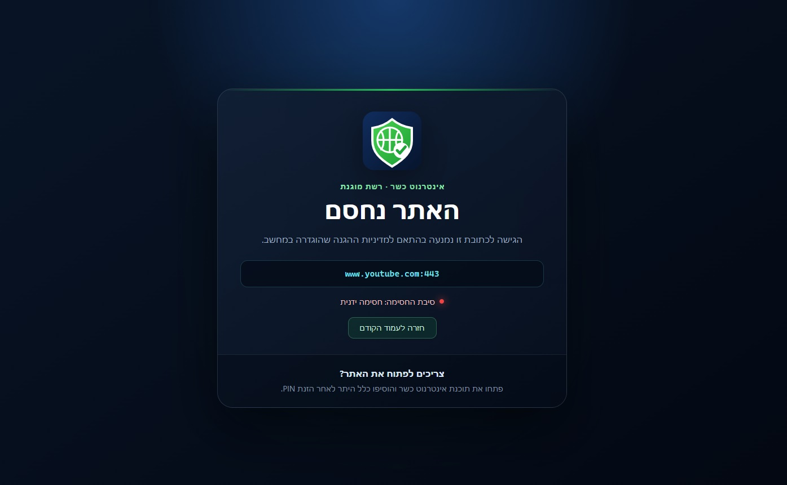

# אינטרנוט כשר · Protected Network

  

  <strong>רשת מוגנת ל־Windows</strong> — חסימה · פרוקסי · DNS · PIN 
  לבית · לעסק · למשרד / <a href="https://servxx.com/he/internot.php">servxx.com</a> · 051-5001481

  
  

## על הלוגו

הלוגו הוא **מגן ירוק עם גלובוס וסימן וי** על רקע כחול־כהה:

- **המגן** — הגנה על הגלישה בבית
- **הגלובוס / הרשת** — סינון תעבורת אינטרנט
- **סימן הוי** — מדיניות מוגנת ופעילה

צבעים: רקע כהה, מגן ירוק, קווים לבנים — בסגנון ממשק כהה של התוכנה.

---

## תמונות מסך

  

<em>לוח בקרה — מצב הגנה, פרוקסי, שירות Guardian וחסימות אחרונות</em>

  

<em>דף חסימה בדפדפן — כתובת שנחסמה לפי מדיניות ההגנה</em>

---

## הורדה

1. היכנסו ל־[**Releases**](https://github.com/ycohen888/internot-kasher/releases/latest)
2. הורידו את **`InternotKasher-1.0.0-Setup.exe`**
3. התקינו כמנהל (המתקין מציג רישיון ומפעיל את שירות Guardian)
4. בפתיחה הראשונה הגדירו **PIN** והפעילו הגנה

> **דרישות:** Windows 10/11 (64-bit). נדרש [WebView2](https://developer.microsoft.com/microsoft-edge/webview2/) — בדרך כלל כבר מותקן ב־Windows.

הורדה ישירה: [⬇ הורדת הגרסה האחרונה](https://github.com/ycohen888/internot-kasher/releases/latest)

---

## מה התוכנה עושה?

**אינטרנוט כשר** היא תוכנת סינון לרשת מוגנת במחשב Windows: חוסמת אתרים לא ראויים ולא צנועים, מנהלת כללי היתר/חסימה, ומאפשרת סינון גם למכשירים נוספים דרך DNS (אופציונלי).

### פלוס לעסקים ומשרדים

מעבר לבית — התוכנה מתאימה גם ל**מחשבי עבודה**, חנויות, עמדות שירות ומחשבים משותפים:

- **מניעת כניסה לאתרים לא צנועים** בזמן העבודה
- **נעילת PIN** — קשה לכבות הגנה / לשנות הגדרות בלי אישור
- **שירות Guardian** — הסינון ממשיך גם אחרי סגירת החלון
- בלי מנוי ובלי מערכת ארגונית כבדה — התקנה על Windows והפעלה

| נושא | פירוט |
|------|--------|
| **שירות Guardian** | הסינון ממשיך גם אחרי סגירת החלון |
| **פרוקסי מערכת** | נעילת Proxy בדפדפנים + בדיקת תקינות |
| **רשימות חסימה** | StevenBlack (תוכן לא צנוע / הימורים ועוד) + כללים ידניים |
| **בדיקת תוכן** | מילות מפתח בחיפושים / כתובות (אופציונלי) |
| **SafeSearch** | כפיית חיפוש בטוח / מצב מוגבל ביוטיוב |
| **DNS רשת** | סינון לטלפונים וטלוויזיות דרך הראוטר |
| **נעילת PIN** | שינוי הגדרות, כיבוי מלא ויציאה — עם קוד |
| **עברית / אנגלית** | ממשק RTL כברירת מחדל, ערכת נושא כהה |

מאגר זה מפיץ את **קובץ ההתקנה בלבד** (ללא קוד מקור).

פרטים נוספים באתר: [servxx.com/he/internot.php](https://servxx.com/he/internot.php)

---

## התחלה מהירה

1. התקינו והגדירו PIN
2. בדקו בלוח הבקרה שההגנה והפרוקסי פעילים
3. מיזעור למגש בסדר — השאירו את השירות רץ
4. לחסימת אתר / היתר: מסך **כללים**, או «התר» מחסימה אחרונה

### DNS רשת (אופציונלי)

1. IP קבוע למחשב (DHCP reservation)
2. Primary DNS בראוטר = כתובת ה־LAN ממסך **DNS רשת**
3. Secondary ריק או זהה — **לא** 8.8.8.8 / 1.1.1.1
4. באנדרואיד: **DNS פרטי = כבוי**

### כיבוי / הסרה

- כיבוי מלא: לוח בקרה → **כבה הכל** → PIN
- הסרה: מ«הוספה או הסרה של תוכניות» — דורשת PIN ומנקה את שינויי המערכת

---

## מגבלות

- הסינון **אינו מוחלט** (Safe Mode, Live USB, VPN, DoH/DoT, אפליקציות שמתעלמות מפרוקסי)
- HTTPS: חסימה בעיקר לפי דומיין
- בלי DNS רשת — מכשירים אחרים בבית אינם מסוננים אוטומטית

---

## רישיון ואחריות

התוכנה **חינמית**, מסופקת **כמות שהיא (AS IS)** ללא אחריות.  
פרטים מלאים ב־[LICENSE](LICENSE).

**שבת:** אין להשתמש בתוכנה בשבת ובימי חול המועד. תודה.

---

## יצירת קשר ודיווח אבטחה

- אתר: [servxx.com](https://servxx.com)
- GitHub: [github.com/ycohen888](https://github.com/ycohen888)
- דוא״ל: [ycohen888@gmail.com](mailto:ycohen888@gmail.com)
- טלפון: **051-5001481**

servxx מפתחת תוכנות שימושיות, כולל כלים לקהילה — בחינם על בסיס זמינות.

---

## English (short)

**Internot Kasher (Protected Network)** is a free Windows desktop filter for home **and** business (Hebrew UI by default).

It blocks immodest / inappropriate sites, locks browser proxy settings, and keeps filtering via the Guardian service — with a **PIN** so protection is hard to turn off. A practical plus for offices, shops, and shared work PCs, without a heavy enterprise subscription.

1. Download the installer from [Releases](https://github.com/ycohen888/internot-kasher/releases/latest)
2. Install as administrator and set a **PIN**
3. Keep the Guardian service running (closing the window is OK when minimize-to-tray is on)

**Logo:** green shield + globe + checkmark — protection, filtered internet, active policy.

Features: local proxy + browser proxy lock, blocklists, manual allow/block rules, optional content keywords, SafeSearch / YouTube Restricted, optional LAN DNS filtering, PIN-locked settings and full shutdown.

Product page: [servxx.com/en/internot.php](https://servxx.com/en/internot.php)

This repository distributes the **installer only** (no source code).

Provided **AS IS**, free of charge. See [LICENSE](LICENSE).  
Contact: [servxx.com](https://servxx.com) · ycohen888@gmail.com · 051-5001481

---

© יוסי כהן / [servxx.com](https://servxx.com) · אינטרנוט כשר v1.0.0
